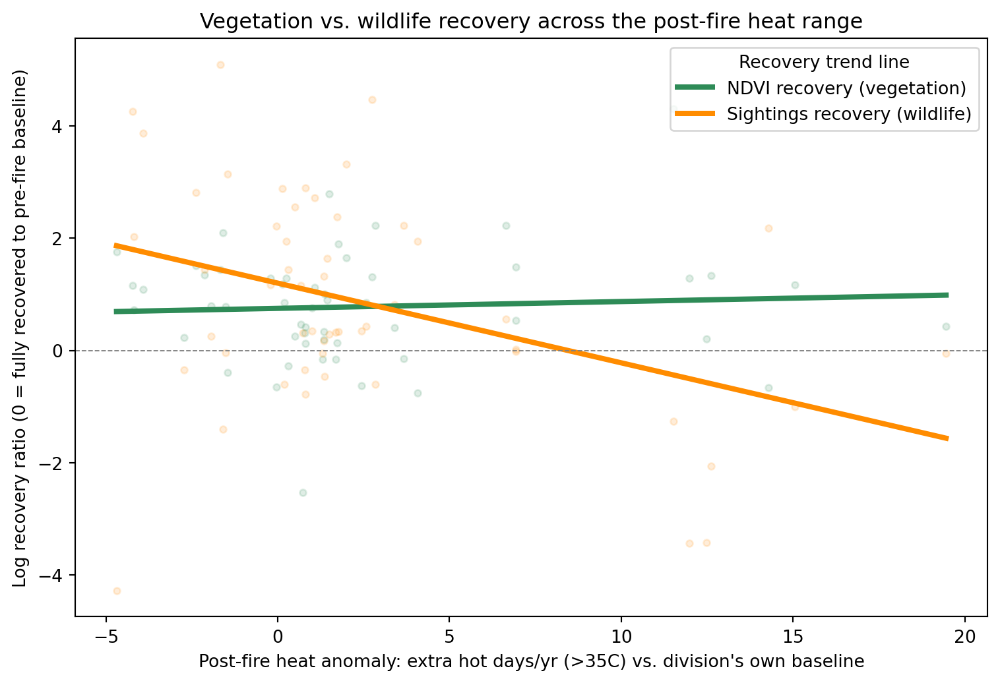
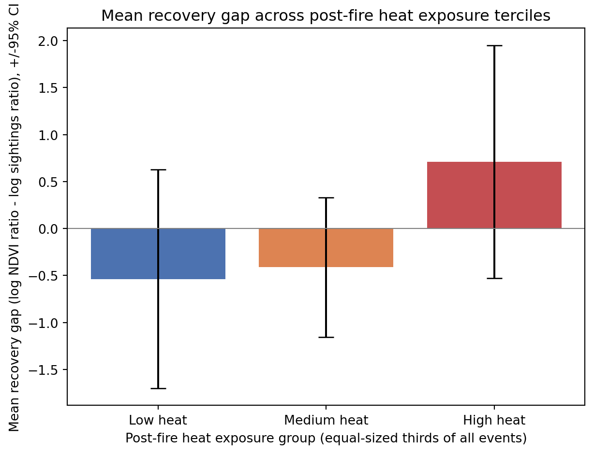

# Fire, Heat, and the Wildlife Recovery Gap in Australia

An entry for the 2026 Winter Data Analysis Challenge, which asks: **“Is Australia doing well?”**

We refine that broad question to:

> **Does post-fire heat exposure widen the gap between vegetation
> recovery and wildlife recovery?**

The project tests whether the return of satellite-observed greenness after a
major fire is enough to conclude that an ecosystem has recovered, particularly
when the following years are unusually hot.

**[Read the complete rendered report](reports/fire_recovery_full_report.html)** ·
**[View the Quarto source](reports/fire_recovery_full_report.qmd)**

## Our answer

Australia should not be judged as “doing well” from satellite greenness alone.
Hotter-than-normal early post-fire periods are associated with weaker
vegetation recovery. Wildlife sightings and the vegetation–wildlife recovery
gap point towards a possible monitoring blind spot, but the wildlife sample is
too limited and uneven to support a definitive national claim.

The current report was executed successfully on 12 September 2026. Its live
results are:

| Result                       |                           Estimate | Interpretation                                                                                           |
| ---------------------------- | ---------------------------------: | -------------------------------------------------------------------------------------------------------- |
| Usable NDVI and heat sample  |     400 fire events, 106 divisions | Covers NSW, QLD, SA, TAS and WA                                                                          |
| Matched wildlife sample      |       53 fire events, 29 divisions | Limited to NSW and QLD after the habitat-data filter                                                     |
| Heat vs. NDVI recovery       | Spearman rho = -0.136, p = 0.00644 | More post-fire heat is associated with weaker vegetation recovery                                        |
| Adjusted heat effect on NDVI |         beta = -0.0140, p = 0.0209 | Controlling for fire severity; 20 extra hot days/year corresponds to about 24.5% lower relative recovery |
| Heat vs. sightings recovery  |  Spearman rho = -0.295, p = 0.0319 | Negative bivariate relationship, but not significant after controlling for severity (p = 0.124)          |
| Heat vs. recovery gap        |   Spearman rho = 0.282, p = 0.0406 | Suggestive evidence that heat widens the gap; the adjusted model is not significant (p = 0.206)          |
| Cluster bootstrap            |              90.6% positive slopes | Directional support, but the 95% interval crosses zero (-0.0548 to 0.3531)                               |

These are associations, not causal effects.

## Visual summary



The paired-event view above uses only the 53 events with both recovery signals.
It is descriptive: the stronger NDVI result in the table uses all 400 eligible
events.



The mean gap changes from negative in the low- and medium-heat groups to
positive in the high-heat group, meaning vegetation recovery increasingly
outpaces recorded wildlife recovery. The wide, overlapping confidence
intervals show why this pattern is treated as suggestive rather than
conclusive.

The full report also contains an interactive division-level recovery-gap map,
distribution plots and regression diagnostics.

## Approach

The unit of analysis is a **major fire event**: one administrative division in
one fire year containing at least one recorded fire of 10,000 hectares or
more.

1. Harmonise fire-history records from seven states and territories and assign
   fires to administrative divisions.
2. Measure vegetation recovery using annual NDVI and recorded wildlife
   recovery using sightings of six forest-associated indicator species.
3. Calculate early post-fire heat exposure as the anomaly in annual days above
   35°C relative to each division's own baseline.
4. Compare vegetation and wildlife recovery using a common recovery ratio and
   define the gap as `log(NDVI recovery ratio) - log(sightings recovery ratio)`.
5. Test the relationships using Spearman correlation, OLS with
   division-clustered standard errors and a cluster bootstrap.

The indicator group comprises koala, greater glider, yellow-bellied glider,
yellow-tailed black-cockatoo, powerful owl and little lorikeet. Sightings are
converted to each division's share of the annual total to partially reduce the
effect of changing citizen-science effort.

## Data

| Dataset                                           | Purpose                                    | Source                                                                                                                      |
| ------------------------------------------------- | ------------------------------------------ | --------------------------------------------------------------------------------------------------------------------------- |
| Jurisdictional fire-history layers                | Fire location, year and area               | NSW, QLD, VIC, SA, TAS, WA and NT open-data portals; links are documented in the report                                     |
| FAO GAUL admin level 2                            | Common division boundaries                 | [Google Earth Engine data catalogue](https://developers.google.com/earth-engine/datasets/catalog/FAO_GAUL_2015_level2)       |
| AusENDVI v0.1.0, 1982–2022                       | Annual vegetation condition                | [Zenodo](https://doi.org/10.5281/zenodo.10802704)                                                                            |
| ERA5-Land daily aggregates, 1982–2022            | Days above 35°C and local heat anomalies  | [Google Earth Engine data catalogue](https://developers.google.com/earth-engine/datasets/catalog/ECMWF_ERA5_LAND_DAILY_AGGR) |
| Atlas of Living Australia occurrences, 1990–2026 | Recorded presence of six indicator species | [Atlas of Living Australia](https://www.ala.org.au/)                                                                         |

The report renders from derived caches so it does not repeat multi-gigabyte
spatial processing or authenticated API requests on every run. The raw-data
construction cells remain in the report for transparency and are marked
`eval: false`.

A fresh clone can read the committed HTML report immediately. To execute the
Quarto source, the local `data/` directory must contain:

- `au_admin2_boundaries.geojson`
- `fire_prone_divisions.csv`
- `fire_events_by_division_year.csv`
- `ndvi_annual_by_division.csv`
- `heat_stress_by_division_year.csv`
- `animal_sightings_by_division_year.csv`

Some large source and cache files are intentionally excluded by `.gitignore`.
Rebuilding them requires the jurisdictional fire layers, the AusENDVI NetCDF
file, a Google Earth Engine account and an Atlas of Living Australia account.

## Reproducing the report

Install [Python](https://www.python.org/) and
[Quarto](https://quarto.org/docs/get-started/), then from the repository root:

```bash
python3 -m venv .venv
source .venv/bin/activate
python -m pip install --upgrade pip
python -m pip install -r requirements.txt
```

Render from the `reports/` directory because the analysis resolves its cache
path relative to that directory:

```bash
cd reports
quarto render fire_recovery_full_report.qmd
```

This creates `reports/fire_recovery_full_report.html`, a self-contained report
with embedded code, figures and interactive Plotly content. If Quarto selects a
different Python installation, point it to the active environment before
rendering:

```bash
export QUARTO_PYTHON="$(which python)"
quarto render fire_recovery_full_report.qmd
```

The latest verified render used Python 3.10.18 and Quarto 1.9.38.

## Repository structure

```text
.
├── README.md
├── requirements.txt
├── data/                          # cached analysis inputs; large raw files ignored
├── notebooks/                     # exploratory notebooks
└── reports/
    ├── fire_recovery_full_report.qmd
    ├── fire_recovery_full_report.html
    └── figures/                   # selected README figures
```

## Important limitations

- The design is observational and cannot establish that heat causes weaker
  recovery.
- Wildlife data are presence-only records affected by observer effort; they
  are not population counts.
- The matched wildlife analysis contains only 53 events in NSW and QLD, so it
  cannot represent Australian wildlife nationally.
- The ACT is not included, and state fire-history products differ in coverage
  and purpose. The current Victorian layer is unsuitable for repeated-fire
  inference and drops out under the analysis thresholds.
- The fire-size, fire-prone-division and wildlife-habitat thresholds are
  analytical choices rather than physical constants.

See the report's limitations and feature definitions for the full discussion.

## Team

- Hieu Do — SID 540914928
- Van Duong — SID 530745613
- Cong Thanh Vu — SID 530784058
